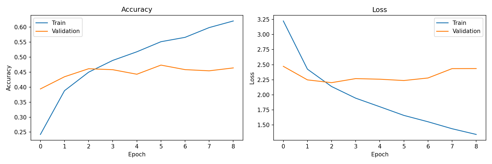

# 🍔 Food Calorie Tracker

A deep learning web application that classifies food images and estimates per-serving calorie content. Built with TensorFlow (MobileNetV2 transfer learning) and served via a Flask web interface, trained on the Food-101 dataset across **101 food categories**.

---

## Abstract

This project fine-tunes a MobileNetV2 model (pretrained on ImageNet) on a subset of the Food-101 dataset to classify food images and return an estimated calorie count. The frozen base model is used as a feature extractor, with a custom classification head trained on top. The trained model is deployed via a Flask web app where users upload a photo and instantly receive the predicted food label, confidence score, and calorie estimate.

---

## Project Structure

```
food-calorie-tracker/
├── README.md
├── requirements.txt
├── data/
│   └── class_names.json               # 101 food class labels
├── notebooks/
│   └── food_calorie_notebook.ipynb    # Full training & evaluation notebook
├── results/
│   └── training_curves.png            # Accuracy & loss plots
└── src/
    ├── app.py                         # Flask web application
    ├── food_model.keras               # Trained model weights (11.2 MB)
    ├── static/
    │   ├── style.css
    │   └── uploads/                   # Auto-created on first run
    └── templates/
        └── index.html
```

---

## Setup Instructions

### 1. Clone the repository
```bash
git clone https://github.com/YOUR_USERNAME/food-calorie-tracker.git
cd food-calorie-tracker
```

### 2. Install dependencies
```bash
pip install -r requirements.txt
```

### 3. Run the app
```bash
cd src
python app.py
```

Open your browser at `http://127.0.0.1:5000`

---

## How It Works

1. User uploads a food photo via the web interface
2. The image is resized to **160×160** and passed through the model
3. Softmax probabilities are computed across 101 classes
4. The top predicted class and its mapped calorie estimate are returned

---

## Model Architecture

| Component | Detail |
|---|---|
| Base model | MobileNetV2 (pretrained on ImageNet, frozen) |
| Input size | 160 × 160 × 3 |
| Custom head | GlobalAveragePooling2D → Dense(128, ReLU) → Dense(101) |
| Loss | SparseCategoricalCrossentropy (from logits) |
| Optimizer | Adam |
| Output | 101-class softmax |

### Data Augmentation
Random horizontal flip, rotation (±10%), and zoom (±10%) applied during training.

---

## Training

| Parameter | Value |
|---|---|
| Training samples | 3,000 batches × 8 = ~24,000 images |
| Validation samples | 800 batches × 8 = ~6,400 images |
| Epochs | 5 |
| Batch size | 8 |
| Final train accuracy | ~46.5% |
| Final val accuracy | ~41.6% |

> **Note:** The model was trained on a limited subset of Food-101 (≈24% of available data) to manage compute constraints. Accuracy can be improved by training on the full dataset and unfreezing the base model layers for fine-tuning.

---

## Results



---

## Dataset

- **Food-101** — 101,000 images across 101 food categories
- Source: [https://data.vision.ee.ethz.ch/cvl/datasets_extra/food-101/](https://data.vision.ee.ethz.ch/cvl/datasets_extra/food-101/)
- The `food-101/` folder is excluded from this repo via `.gitignore`

---

## Tech Stack

| Layer | Technology |
|---|---|
| Model | TensorFlow 2.x / Keras |
| Base architecture | MobileNetV2 |
| Web framework | Flask |
| Image processing | Pillow, NumPy |
| Frontend | HTML, CSS |
| Language | Python 3.13 |

---

## Known Limitations

- Trained on a subset of Food-101; accuracy improves significantly with full dataset training
- Calorie values are fixed per-class averages, not portion-size aware
- GPU training not available on native Windows with TF ≥ 2.11 (WSL2 recommended for future training runs)
